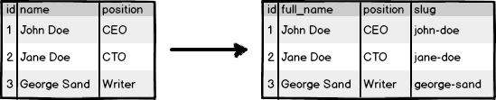
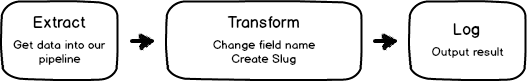

Recipe: build a trivial transformation
======================================

What we want to achieve
-----------------------

Pipeline structure
------------------

Code
----

.. literalinclude:: ../../example/cookbook/01_simple.py
   :language: python
   :linenos:

Output
------

.. code-block:: shell

    $ python example/cookbook/01_simple.py

    ····{1}·····················································
      id:int → «1»
      position:str → «CEO»
      slug:str → «john-doe»
      full_name:str → «John Doe»
    ····························································

    ····{2}·····················································
      id:int → «2»
      position:str → «CTO»
      slug:str → «jane-doe»
      full_name:str → «Jane Doe»
    ····························································

    ····{3}·····················································
      id:int → «3»
      position:str → «Writer»
      slug:str → «george-sand»
      full_name:str → «George Sand»
    ····························································

