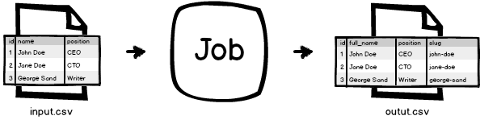
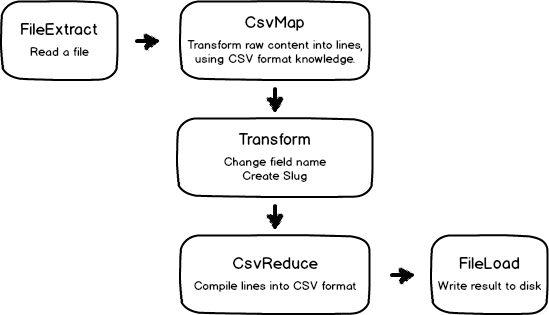

Recipe: Read and write from/to CSV files
========================================

What we want to achieve
-----------------------

We want to write the exact transformation that we wrote in :doc:`01_simple`, except that we will read data from an
input CSV file, and write the result to an output CSV file.

Pipeline structure
------------------

