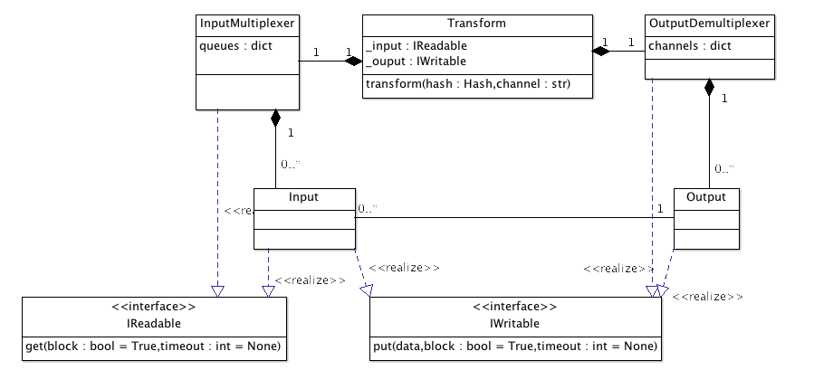

Input / output design
=====================

.. module:: rdc.etl.io

Basics
::::::

All you have to know as an ETL user, is that each transform may have 0..n input channels and 0..n output channels. Mostly
because it was fun, we named the channel with representative *nix-file-descriptor-like names, but the similarity ends
to the name.

The ``input multiplexer`` will group together whatever comes to one of the inputs channels and pass it to the
transformation's ``transform()`` method.

.. currentmodule:: rdc.etl.transform
.. autoclass:: ITransform

    .. automethod:: transform(hash, [channel=STDIN])

The transform method should be a generator, yielding output lines (with an optional output channel id):

.. code-block:: python

    def transform(hash, channel=STDIN):
        yield hash.copy({'foo': 'bar'})
        yield hash.copy({'foo': 'baz'})

Input and output
::::::::::::::::

All transforms are expected to have the following attributes:

.. module:: rdc.etl.io

* ``_input``, which should implement ``IReadable``
* ``_output``, which should implement ``IWritable``

When you're using ``rdc.etl.transform.Transform``, the base class will create them for you as an ``InputMultiplexer`` and
an ``OutputDemultiplexer``, each one having a list of channels populated after reading the ``INPUT_CHANNELS`` and
``OUTPUT_CHANNELS`` transformation attributes. By default, transformations have one default ``STDIN`` input, one default
``STDOUT`` output and one alternate ``STDERR`` output. You can virtually have infinite input or outputs in your
transformations (as though I have hard time imagining a use).

.. autoclass:: InputMultiplexer
.. autoclass:: OutputDemultiplexer

Example
:::::::

Here is a simple transform that takes whatever comes to STDIN and put it on STDOUT and STDOUT2, and that puts everything
that comes to STDIN2 and send it to STDERR.

.. code-block:: python

    from rdc.etl.transform import Transform
    from rdc.etl.io import STDIN, STDIN2, STDOUT, STDOUT2, STDERR

    class MyTransform(Transform):
        INPUT_CHANNELS = (STDIN, STDIN2, )
        OUTPUT_CHANNELS = (STDOUT, STDOUT2, STDERR, )

        def transform(self, hash, channel=STDIN):
            if channel == STDIN:
                yield hash
                yield hash, STDOUT2
            elif channel == STDIN2:
                yield hash, STDERR

..
    Input / Output
    ==============

    ..todo:: TODO write and schematize this

    Thread runs self.transform.step()

    If transform is not yet initialized, transform runs initialize().

    Transform reads from input multiplexer.

    Transform runs transform(data, channel).

    Transform sends each yielded data, channel to output demultiplexer.

    When all inputs are terminated (meaning input multiplexer is terminated too), transform runs finalize(), then sends
    the EndOfStream special token to the output multiplexer.

    IReadable defines something we can read from.

    IWritable defines something we can write into.

    OutputMultiplexer is an IWritable that will decode each data put() into it into a (data, channel) tuple, and send data
    to targeted IWritable for the given channel.

    InputMultiplexer is a IReadable that allows to get() data from a list of channel-assigned IReadable, and returns a
    (data, channel) tuple for use in transformations.

    Input implements IReadable and IWritable to make the glue between InputMultiplexer and OutputMultiplexer. While it's
    "owned" by the InputMultiplexer, OutputMultiplexer gets a reference to use as "targets" (via the IWritable interface).

    Transformation - Input side
    :::::::::::::::::::::::::::

     _ _ _                ___________       ________________
    |_|_|_| (stdin) ---> |           |     |                |
     _ _ _               | Input MUX | --> | Transformation |
    |_|_|_| (stdin2) --> |___________|     |________________|

    The input side owns the input queues (Input), that contains the real data. Of course, stdin and stdin2 are just an
    example and a transformation may have only one input, or a huge list of inputs. Most transformations will only have one
    input though.

    Queues have no idea of who will put() data, and thus we use the `Begin` token to declare ourselves.

    Transformation - Output side
    ::::::::::::::::::::::::::::

     ________________       _____________
    |                |     |             | --> (stdout)
    | Transformation | --> | Output DMUX |
    |________________|     |_____________| --> (stderr)

    stdout/stderr are "named" channels, and on the output dmux side there may be a list of input queue references registered
    as "targets" for those.

